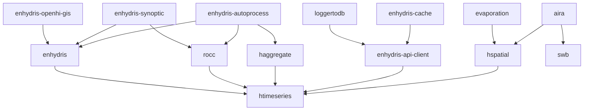

# dependencies
A chart with the dependencies between software pieces of openmeteo

```mermaid
graph TD;
enhydris-->htimeseries
enhydris-openhi-gis-->enhydris

enhydris-synoptic-->enhydris
enhydris-synoptic-->rocc

enhydris-autoprocess-->enhydris
enhydris-autoprocess-->haggregate
enhydris-autoprocess-->rocc

rocc-->htimeseries
haggregate-->htimeseries
enhydris-api-client-->htimeseries
loggertodb-->enhydris-api-client

hspatial-->htimeseries
evaporation-->hspatial
enhydris-cache-->enhydris-api-client

aira-->swb
aira-->hspatial
```
